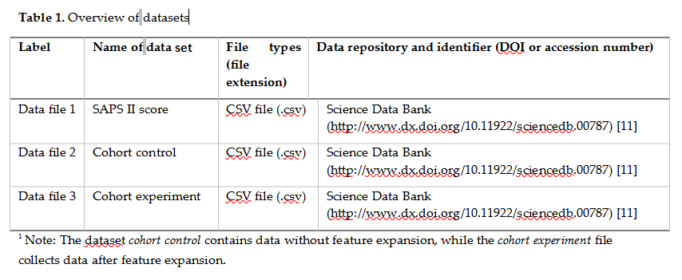

## Introduction
In this project, we selected ICU patients with pelvic and/or acetabular fractures based on ICD-9 codes from MIMIC-III database. Then, we used three mainstream machine learning algorithms (logistic regression, decision tree and random forest) to establish models, and compare their predictive performance with that of the Simplified Acute Physiology Score (SAPS), a standard prediction system currently used in clinic, via the Receiver Operating Characteristic (ROC) curve and Area Under ROC curve (AUROC). To improve the performance of machine learning-based models, we expanded the range of variable selection by the combination of SAPS-based parameters and more laboratory indicators.

This project is a python implementation of our work.

## Data
### Database build
Starting from a fresh system which has GNU Make installed, PostgreSQL installed, and a local copy of this repository, an instance of the the local mimic database with the usefule raw data from PhysioNet. Source code for the local database refers to [MiMic code repository](https://github.com/MIT-LCP/mimic-code).

### Data prepration
We identified patients who were diagnosed as pelvic, acetabular, or combined pelvic and acetabular fractures according to ICD-9 code and who survived at least 72 hours after the ICU admission. All the data within the first 72 hours following ICU admission were collected and extracted from the MIMIC-III clinical database version 1.4. The final datasets for this project were uploaded on a public website. 

## License
Licensed under the Apache License, Version 2.0.
